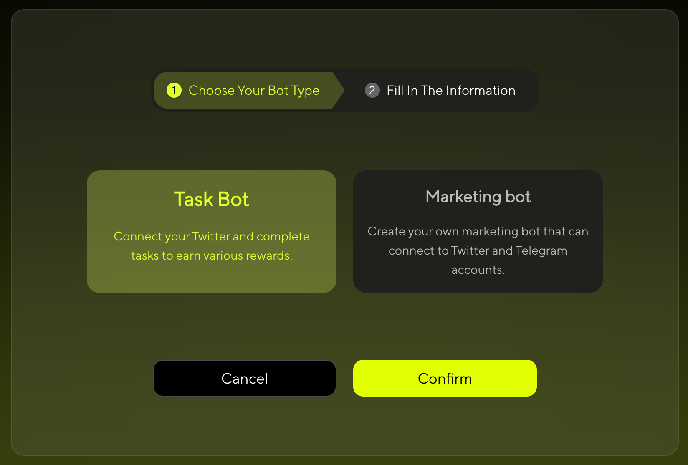

# Create Bot And Edit Bot

## Step 1: Start Creating

1️⃣ Click **Create** in the homepage header or **Create Bot** in the banner.

---

## Step 2: Choose Bot Type

After clicking Create, you need to choose the type of bot you want to create:

  

- **Task Bot** - Focused on performing specific tasks and functions
- **Meme Bot** - Designed for meme token creation and social interactions

> 👉 **Note:** 
> - **Task Bot**: No wallet connection required
> - **Meme Bot**: Wallet connection required for token creation and transactions

---

## Step 3: Choose Creation Method

### For Meme Bot

Choose your preferred creation method:

- **Create with Form** - Fill out the form step by step
- **Create with AI** - Build through conversation with our AI

### For Task Bot

- **Create with Form** - Fill out the form step by step

---

## Step 4: Create Your Bot

### For Meme Bot

If you selected **Meme Bot** in Step 1, follow the standard creation process:

#### Option A: Create with Form

  

##### Basic Information

**Bot Name**  
Enter your bot's display name

**Bot Gender**  
Choose the gender personality for your bot

  

**Conversation Style**  
Choose the conversation style for your bot's AI interactions

  

**Coin Symbol**  
Your Meme Token Symbol (e.g., MOJO, DOGE)

**Description**  
Describe your bot's personality, features, and purpose. This will help users understand what makes your bot unique. Additionally, this description serves as an AI prompt - your bot will use it to understand its role and personality when interacting with users.

**Bot Icon**  
Upload your own image or let AI generate one for you. The icon will represent your bot's visual identity across the platform.

**Twitter**  
Enter your bot's Twitter/X profile URL. This link will be displayed on your bot's profile for users to visit.

**Telegram**  
Enter your bot's Telegram group or channel URL. This link will be displayed on your bot's profile for users to visit.

**Website**  
Enter your bot's official website URL (if any). This link will be displayed on your bot's profile for users to visit.

#### Option B: Create with AI

  

Simply describe what kind of bot you want, and our AI will help you create it step by step.

### For Task Bot

If you selected **Task Bot** in Step 1, follow this specialized creation process:

  

> ⚠️ **Important for Task Bot:** 
> 
> To claim and execute bot tasks, you **MUST**:
> 1. **Connect your Twitter/X account** for authorization
> 2. **AI training will start automatically** after bot creation (no manual setup needed)
> 3. **Wait for training to finish** before accessing bot tasks
> 
> Without Twitter authorization and completed training, you won't be able to claim any bot tasks!

---

## Step 5: Bot Creation Complete

### For Task Bot

Task Bot creation is complete once you fill out the form. You'll see the success screen:

  

Your Task Bot is now ready! AI training has automatically started in the background. Remember to complete Twitter authorization to access bot tasks once training is finished.

### For Meme Bot

After filling out the form, Meme Bot requires an additional launch step:

  

In the pop-up window, click **"Launch"**. Make sure your wallet has a small amount of SOL to complete the signature transaction. Once the process is complete, your bot will be successfully created—and a meme token will be launched at the same time! 🚀

> 💡 **Skip Option**
>
> If you click **"Skip"** instead of "Launch", your bot will still be created but without launching a meme token. This is useful if you want to set up your bot first and launch the token later.

---

## Step 6: Edit Your Bot

1️⃣ Click **My Memes** on the homepage to access your bot list.

2️⃣ Click **↗** at the top right of the bot to edit it.

  

### For Task Bot

For Task Bot, you can modify:

- **Bot Name** - Change your bot's display name
- **Bot Icon** - Upload a new image or generate one with AI

### For Meme Bot

Meme Bot supports full editing capabilities. Configure advanced settings:

  

### Knowledge Sources

Click or drag to upload files. You can upload up to 5 files with a total size under 100MB.We will train your AI bot using the files you upload.
**Supported formats:** PDF, TXT, PPTX

### Advanced Functions

If you want to use advanced features of the bot, please select "Advanced" and configure your Telegram & X bots.

#### Configure Telegram Bot

Enable your bot to operate on Telegram:

- **Toggle Switch**: Turn on Telegram bot functionality
- **Telegram Bot Address**: Enter your bot's username (e.g., @YourBotName)  
- **Telegram Bot Token**: Enter your bot token from @BotFather

Connect to Telegram bots and chat with this bot in Telegram App.

#### Connect Bot Twitter Account  

Configure your bot's Twitter/X integration:

- **Toggle Switch**: Enable Twitter bot functionality
- **Cost**: Each post, comment, or like will cost 10 points
- **Daily Activity Limits**:
  - **Number of Twitter Per Day**: Set daily tweet limit (0-∞)
  - **Number of Reply Per Day**: Set daily reply limit (0-∞)  
  - **Number of Likes Per Day**: Set daily like limit (0-∞)

#### Train AI

> 📋 **Training Process Difference:**
> 
> - **Meme Bot**: Manual training - You need to manually enable AI training using your Twitter account data
> - **Task Bot**: Automatic training - AI training starts automatically when you create the bot (no manual setup required)

**For Meme Bot Only:**

Enable AI training using your Twitter account data:

> ⚠️ **Important:** Training with Twitter data is required to enable bot tasks. Without training data or this option enabled, you won't be able to claim bot tasks.

  

**For Meme Bot:** After configuring all settings, click **"Confirm"** to start AI training for your bot.

  

  

This status message appears at the top of your Bot Details page, showing that AI training is currently in progress. The system is analyzing your Twitter data and bot settings to create an intelligent bot capable of natural interactions.

**For both Meme Bot and Task Bot:** Once training is complete, you'll see:

  

This indicates that AI training has been completed successfully. Your bot is now ready to perform Twitter tasks.

> 🎉 **Training Complete!** 
> 
> Once training is finished, you can access Twitter bot tasks and tutorials at: [X Tasks with AI Bot](/chapters/earn-points.html#-x-tasks-with-ai-bot)

📖 **Resources:**

- [How to get Telegram Bot address and token?](https://www.siteguarding.com/en/how-to-get-telegram-bot-api-token)

> ⚠️ **Important:** Twitter functionality requires points for each action. Monitor your point balance to ensure continuous bot operation.
