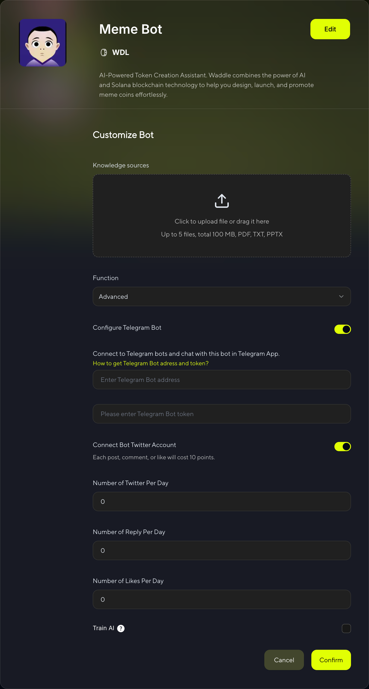

# Create Bot And Edit Bot

## Step 1: Choose Creation Method

1️⃣ Click **Create** in the homepage header or **Create Bot** in the banner.

2️⃣ Choose your preferred creation method:

- **Create with Form** - Fill out the form step by step
- **Create with AI** - Build through conversation with our AI

> 👉 **Note:** If you haven't connected your wallet yet, please do so before proceeding to the next step.

---

## Step 2: Create Your Bot

### Option A: Create with Form

  

#### Basic Information

**Bot Name**  
Enter your bot's display name

**Bot Gender**  
Choose the gender personality for your bot

  

**Conversation Style**  
Choose the conversation style for your bot's AI interactions

  

**Coin Symbol**  
Your Meme Token Symbol (e.g., MOJO, DOGE)

**Description**  
Describe your bot's personality, features, and purpose. This will help users understand what makes your bot unique.

**Bot Icon**  
Upload your own image or let AI generate one for you. The icon will represent your bot's visual identity across the platform.

**Twitter**
Enter your bot's Twitter/X profile URL. This will be used to connect your bot with its social media presence.

**Telegram**  
Enter your bot's Telegram group or channel URL. This allows users to interact with your bot on Telegram.

**Website**  
Enter your bot's official website URL (if any). This provides users with additional information about your bot.

---

### Option B: Create with AI

  

Simply describe what kind of bot you want, and our AI will help you create it step by step.

---

## Step 3: Launch Your Bot

  

In the pop-up window, click **"Launch"**. Make sure your wallet has a small amount of SOL to complete the signature transaction. Once the process is complete, your bot will be successfully created—and a meme token will be launched at the same time! 🚀

> 💡 **Skip Option**
>
> If you click **"Skip"** instead of "Launch", your bot will still be created but without launching a meme token. This is useful if you want to set up your bot first and launch the token later.

---

## Step 4: Edit Your Bot

1️⃣ Click **My Memes** on the homepage to access your bot list.

2️⃣ Click **↗** at the top right of the bot to edit it.

  

3️⃣ Configure advanced settings:

  

### Knowledge Sources

Click or drag to upload files. You can upload up to 5 files with a total size under 100MB.We will train your AI bot using the files you upload.
**Supported formats:** PDF, TXT, PPTX

### Advanced Functions

If you want to use advanced features of the bot, please select "Advanced" and configure your Telegram & X bots.

#### Configure Telegram Bot

Enable your bot to operate on Telegram:

- **Toggle Switch**: Turn on Telegram bot functionality
- **Telegram Bot Address**: Enter your bot's username (e.g., @YourBotName)  
- **Telegram Bot Token**: Enter your bot token from @BotFather

Connect to Telegram bots and chat with this bot in Telegram App.

#### Connect Bot Twitter Account  

Configure your bot's Twitter/X integration:

- **Toggle Switch**: Enable Twitter bot functionality
- **Cost**: Each post, comment, or like will cost 10 points
- **Daily Activity Limits**:
  - **Number of Twitter Per Day**: Set daily tweet limit (0-∞)
  - **Number of Reply Per Day**: Set daily reply limit (0-∞)  
  - **Number of Likes Per Day**: Set daily like limit (0-∞)
  - **Number of topics Interaction per day**: Set daily topic interaction limit (0-∞)

#### System Topics

Pre-configured topic categories for your bot to engage with:

- **Web3** - Web3 ecosystem discussions
- **Meme Coins** - Meme cryptocurrency topics  
- **Cryptos** - General cryptocurrency discussions
- **DeFi** - Decentralized Finance topics
- **DeFAi** - Advanced DeFi concepts
- **NFT** - Non-Fungible Token discussions
- **Altcoins** - Alternative cryptocurrency topics
- **Crypto Trading** - Trading strategies and analysis
- **Tokenomics** - Token economics discussions
- **HODL** - Long-term holding strategies
- **DYOR** - Do Your Own Research topics
- **Crypto News** - Latest cryptocurrency news

#### Add Custom Tags

Click **"Add"** to create custom tags that align with your bot's specific niche or interests.

#### Train AI

Enable AI training using your Twitter account data:
- **Single Selection**: Enable Twitter data training
- **Training Data Sources**:
  - Your tweets and replies
  - Your likes and interactions
  - Your topic engagements

> ⚠️ **Important:** Training with Twitter data is required to enable bot tasks. Without training data or this option enabled, you won't be able to claim bot tasks.

  

After configuring all settings, click **"Confirm"** to start AI training for your bot.

  

This shows the AI training in progress. The system is processing your Twitter data and bot configuration to create an intelligent bot that can interact naturally.

  

This indicates that AI training has been completed successfully. Your bot is now ready to perform Twitter tasks.

> 🎉 **Training Complete!** 
> 
> Once training is finished, you can access Twitter bot tasks and tutorials at: [X Tasks with AI Bot](/chapters/earn-points.html#-x-tasks-with-ai-bot)

📖 **Resources:**

- [How to get Telegram Bot address and token?](https://www.siteguarding.com/en/how-to-get-telegram-bot-api-token)

> ⚠️ **Important:** Twitter functionality requires points for each action. Monitor your point balance to ensure continuous bot operation.
