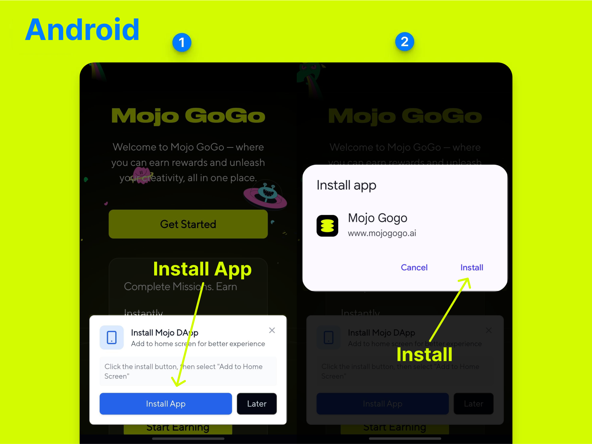
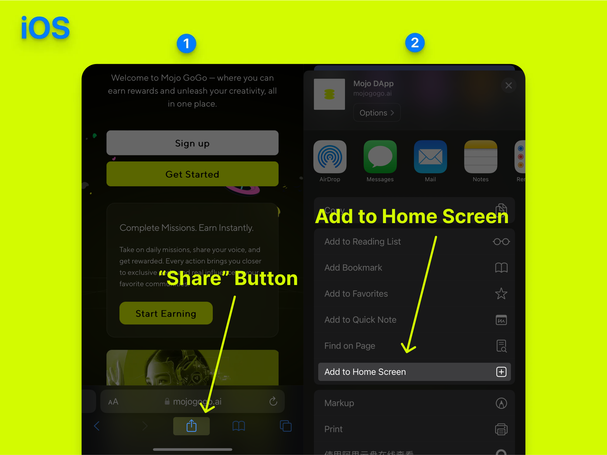

# Install Mojo Gogo to Home Screen

## 📌 Before You Start

**Before you start, please make sure your phone meets the following requirements.**

> 💡 **Supported Device and Browser**
>  - On Android, Firefox, Chrome, Edge, Opera, and Samsung Internet Browser all support installing PWAs.
>  - On iOS 16.3 and earlier, PWAs can only be installed with Safari.
>  - On iOS 16.4 and later, PWAs can be installed from the Share menu in Safari, Chrome, Edge, Firefox, > and Orion.

## 📱 Installation Steps

### 1️⃣ Open Mojo Gogo with Your Mobile Browser

Open [https://mojogogo.ai/](https://mojogogo.ai/) with your **mobile browser**

### 2️⃣ Add Mojo Gogo to Home Screen

#### For Android Users:

  

#### For iOS Users:

  

### 3️⃣ Open Mojo Gogo App from Your Mobile Home Screen

Once installed, you can open the Mojo Gogo app directly from your mobile home screen, just like a native app!

## 🎯 Benefits of PWA Installation

- **Faster Access**: Launch Mojo Gogo directly from your home screen
- **Better Performance**: Optimized for mobile devices
- **Offline Capability**: Some features work even without internet
- **Native App Feel**: Looks and feels like a regular mobile app
- **No App Store Required**: Install directly from your browser

## 🔧 Troubleshooting

If you encounter any issues during installation:

1. **Make sure your browser is up to date**
2. **Check if your device meets the minimum requirements**
3. **Try clearing your browser cache and cookies**
4. **Ensure you have a stable internet connection**
