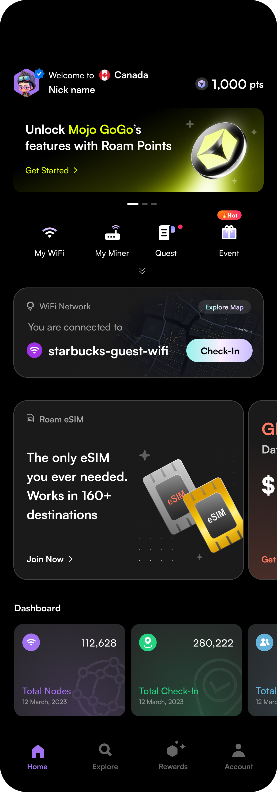
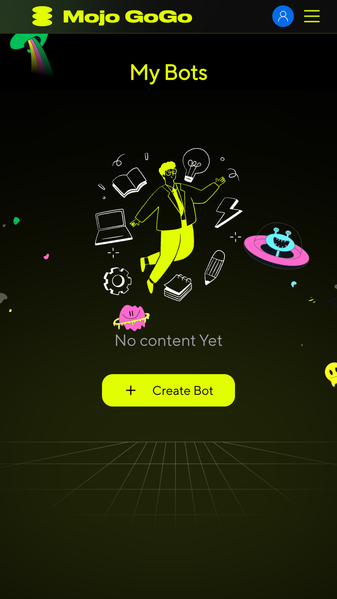
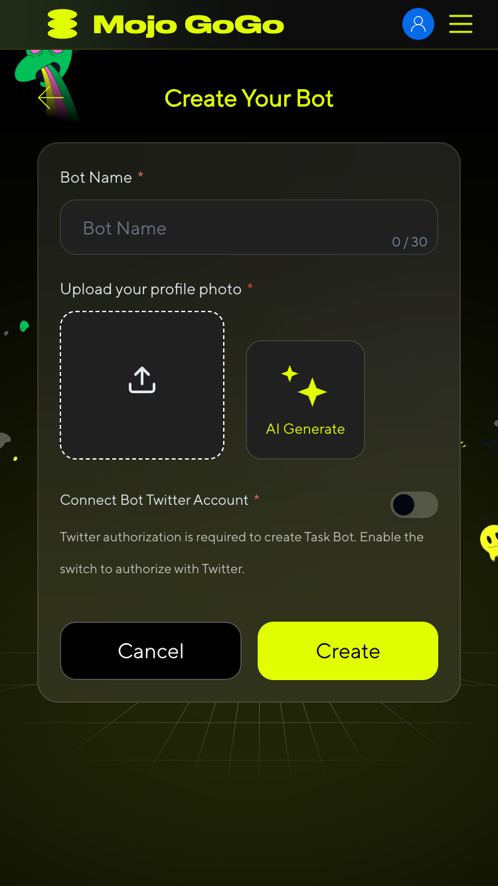

# Roam Points

## 📌 Roam Introduction
A Global Decentralized Wireless Network Built for You by Leveraging DePIN, eSIM, and Blockchain Technology.

## Earn Roam Points in Mojo GoGo
1️⃣ After downloading the Roam app, enter the Mojo GoGo official website through the homepage banner. 

  

2️⃣ Click **Get Started** to enter the events page, log in to your Mojo GoGo account, and start earn Roam Points. 

  

  

3️⃣ 

