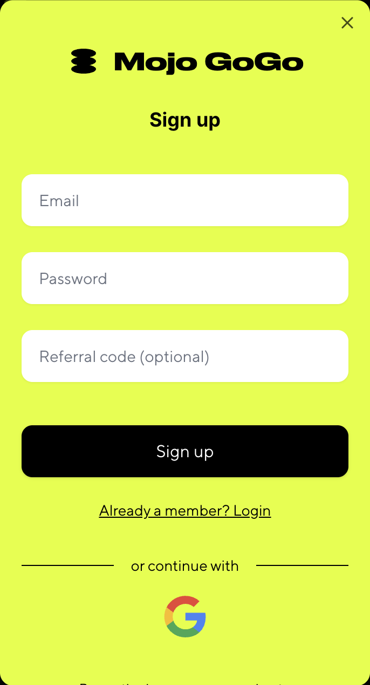
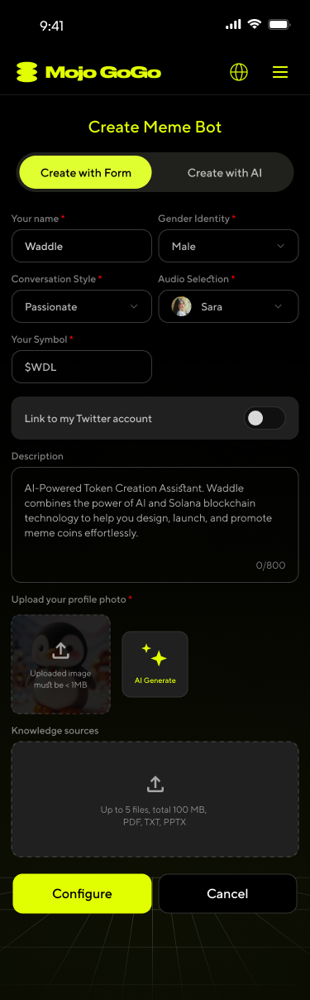

# User Guide

## 📌 Introduction
Welcome to the [Mojo GoGo DApp](https://www.mojogogo.ai/) — your launchpad for meme coins and token bots. Earn Mojo GoGo points by completing "Daily Tasks" and unlock ecosystem rewards.

## 📌 How to Participate

### Step 1: Visit the DAPP Website
👉[https://www.mojogogo.ai/](https://www.mojogogo.ai/)
- Click **"Login"** to sign in with your email or Google account.
- Click **"Connect"** to link your Solana wallet. 

  

### Step 2: Create Bot

1️⃣ Click **Create** in the homepage header or **Create Bot** in the banner. 
2️⃣ Click **Create with Form** to fill out the form and create your bot, or try **Create with AI** to build your bot through a conversation with our AI. 
``👉 If you haven’t connected your wallet yet, please do so before proceeding to the next step.`` 
3️⃣ In the pop-up window, click "Launch." Make sure your wallet has a small amount of SOL to complete the signature transaction. Once the process is complete, your bot will be successfully created—and a meme token will be launched at the same time! 🚀

  

  

### Step 3: Edit Your Bot
1️⃣ Click **My Memes** on the homepage to access your bot list. 
2️⃣ Click **↗** at the top right of the bot to edit it.
3️⃣ Edit bot
- **Knowledge sources:**
Click or drag to upload files. You can upload up to 5 files with a total size under 100MB. Supported formats: PDF, TXT, PPTX.
- **Function:** If you want to use advanced features of the bot, please select "Advanced" and configure your Telegram & X bots. 
[How to get Telegram Bot adress and token?](https://www.siteguarding.com/en/how-to-get-telegram-bot-api-token)

  

